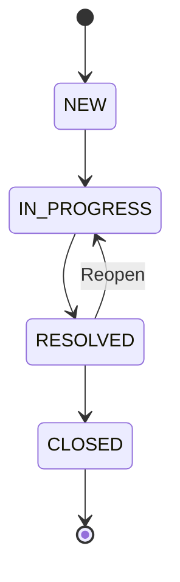

# TicketFlow

A backend REST API for IT support ticket management, built from scratch in Java/Spring Boot — no scaffolding, no code generation, no AI coding assistants.

> **Status:** In active development. Core API is functional and curl-verified. See [Roadmap](#roadmap) for what's next.

---

## What This Is

TicketFlow is a support ticket system backend: customers submit tickets, agents work them, admins manage assignment and workflow. It covers authentication, authorization, ticket lifecycle, automatic workload distribution, and threaded comments with visibility rules.

This is a **backend-only** project. There is no frontend — that's a deliberate scope choice, not a gap. Every endpoint is verified via curl against a running PostgreSQL instance.

**Why it exists:** To demonstrate that I can build a production-shaped backend by hand — understanding every annotation, every SQL migration, every framework decision — not just wire together tutorials.

---

## Tech Stack

| Layer | Technology |
|---|---|
| Language | Java 21 |
| Framework | Spring Boot 3 |
| Build | Gradle |
| Database | PostgreSQL 16 |
| Auth | JWT (HS384) — access + refresh tokens |
| Schema | Flyway versioned migrations |
| ORM | Spring Data JPA / Hibernate |
| Security | Spring Security 6 |
| Testing | JUnit 5, MockMvc, @SpringBootTest |
| Container | Docker (database) |

---

## Architecture

```mermaid
graph TD
    Client[Client / curl] -->|HTTP + JWT| Controller
    Controller -->|@Valid, @PreAuthorize| Service
    Service -->|JPA| Repository
    Repository -->|SQL| DB[(PostgreSQL 16)]

    subgraph Auth Flow
        Register[POST /register] --> AuthService
        Login[POST /login] --> AuthService
        AuthService -->|BCrypt hash| UserRepo
        AuthService -->|HS384 sign| JwtService
        JwtService -->|Access Token: 15min| Client
        JwtService -->|Refresh Token: 7 days| Client
    end

    subgraph Request Auth
        Client -->|Bearer token| JwtFilter[JwtAuthenticationFilter]
        JwtFilter -->|Extract UUID + role| SecurityContext
        SecurityContext --> Controller
    end
```



The state machine is enforced at the domain level — `TicketStatus.canTransitionTo()` validates every transition before the service layer allows it. Invalid transitions throw, not silently succeed.

---

## API Endpoints

### Authentication (public — no token required)

| Method | Path | Status | Description |
|---|---|---|---|
| POST | `/api/v1/auth/register` | 201 | Register a new user (defaults to CUSTOMER role) |
| POST | `/api/v1/auth/login` | 200 | Login, returns access + refresh tokens |
| POST | `/api/v1/auth/refresh` | 200 | Exchange refresh token for new access token |

### Tickets (Bearer token required)

| Method | Path | Role | Status | Description |
|---|---|---|---|---|
| POST | `/api/v1/tickets` | Any | 201 | Create ticket, auto-assigns least-loaded agent |
| GET | `/api/v1/tickets` | Any | 200 | List tickets (CUSTOMER sees own only). Supports `?status=`, `?page=`, `?size=` |
| GET | `/api/v1/tickets/{id}` | Any | 200 | Get single ticket by ID |
| PATCH | `/api/v1/tickets/{id}/status` | AGENT, ADMIN | 200 | Update ticket status (validated by state machine) |
| PATCH | `/api/v1/tickets/{id}/assign` | ADMIN | 200 | Manually assign ticket to an agent |

### Comments (Bearer token required)

| Method | Path | Role | Status | Description |
|---|---|---|---|---|
| POST | `/api/v1/tickets/{ticketId}/comments` | Any | 201 | Add comment. CUSTOMER cannot set `internal=true` |
| GET | `/api/v1/tickets/{ticketId}/comments` | Any | 200 | List comments. CUSTOMER sees public only; AGENT/ADMIN see all |

---

## Roles and Access

| Role | How assigned | Can do |
|---|---|---|
| **CUSTOMER** | Default on registration | Create tickets, view own tickets, add/view public comments |
| **AGENT** | Manual SQL promotion | View all tickets, update status, add/view all comments (including internal) |
| **ADMIN** | Manual SQL promotion | Everything AGENT can do, plus assign tickets to agents |

Role promotion is manual SQL only — no role-management endpoint. This is a deliberate scope choice: the project focuses on the ticket workflow, not user administration.

```sql
UPDATE users SET role = 'AGENT' WHERE email = 'agent@example.com';
UPDATE users SET role = 'ADMIN' WHERE email = 'admin@example.com';
```

After promotion, the user must log in again to receive a token with the updated role.

---

## Design Decisions

### State Machine for Status Transitions
`TicketStatus` is a Java enum with a `canTransitionTo()` method containing a hardcoded `Set` of allowed transitions per status. The service layer calls this before allowing any update. This means invalid transitions (e.g., NEW → CLOSED) are rejected at the domain level, not caught by business logic scattered across the codebase.

### Database-Level Round-Robin Assignment
When a ticket is created, the system automatically assigns it to the least-loaded agent. This uses a native SQL query with `LEFT JOIN` + `COUNT` + `GROUP BY` + `ORDER BY ASC LIMIT 1` — the database does the aggregation, not Java. Agents with zero tickets still appear thanks to the LEFT JOIN. If no agents exist, the ticket is created unassigned.

```sql
SELECT u.*, COUNT(t.id) AS ticket_count
FROM users u
LEFT JOIN tickets t ON t.assigned_to = u.id AND t.status != 'CLOSED'
WHERE u.role = 'AGENT'
GROUP BY u.id
ORDER BY ticket_count ASC
LIMIT 1;
```

### Comment Visibility
Comments have an `internal` boolean flag (defaults to `true` for safety — better to accidentally hide a comment from a customer than expose an internal note). The repository has two query methods: `findByTicketId` (agents/admins see everything) and `findByTicketIdAndInternalFalse` (customers see public only). The controller extracts the caller's role and routes to the correct query.

### Flyway Over Auto-DDL
Schema is managed by versioned SQL migrations, not Hibernate's `ddl-auto`. Every table change is an explicit, reviewable SQL file. This is what production systems use.

### JWT with Refresh Tokens
Access tokens expire in 15 minutes. Refresh tokens last 7 days. This balances security (short-lived access) with usability (users don't re-login constantly).

### @PrePersist Over @CreationTimestamp
Timestamps use JPA lifecycle callbacks instead of Hibernate's `@CreationTimestamp`. A bug during development revealed that `@CreationTimestamp` defers the value until Hibernate flush, returning `null` in the API response before that happens. `@PrePersist` sets the value immediately.

---

## Sample Request / Response

**Register and get a token:**
```bash
curl -s -X POST http://localhost:8081/api/v1/auth/register \
  -H "Content-Type: application/json" \
  -d '{"email":"customer@example.com","password":"password123","fullName":"Customer User"}'
```

**Create a ticket (auto-assignment in action):**
```bash
curl -s -X POST http://localhost:8081/api/v1/tickets \
  -H "Authorization: Bearer $TOKEN" \
  -H "Content-Type: application/json" \
  -d '{"title":"Slow Wifi","description":"Wifi is very slow","priority":"LOW"}'
```

Response — note `assignedToName` is populated automatically:
```json
{
  "id": "9bb0966d-8bb4-4d6d-a1b5-b1b26e6d3d29",
  "title": "Slow Wifi",
  "description": "Wifi is very slow",
  "status": "NEW",
  "priority": "LOW",
  "creatorName": "Customer User",
  "assignedToId": "f8548efa-d645-4828-91db-31964dbde8c8",
  "assignedToName": "Agent One",
  "createdAt": "2026-07-26T22:23:55",
  "updatedAt": "2026-07-26T22:23:55"
}
```

Agent One was assigned because they had the fewest active tickets at creation time. With two agents at 3 tickets each and Agent One at 0, the system correctly picked the least-loaded agent.

---

## Getting Started

### Prerequisites
- Java 21
- Docker
- Gradle (or use the included wrapper)

### 1. Start the database
```bash
docker run -d --name ticketflow-db \
  -e POSTGRES_USER=ticketflow \
  -e POSTGRES_PASSWORD=ticketflow \
  -e POSTGRES_DB=ticketflow \
  -p 5432:5432 postgres:16
```

### 2. Run the application
```bash
./gradlew bootRun
```

Flyway runs migrations automatically on startup. The API is available at `http://localhost:8081`.

### 3. Register a user and get a token
```bash
curl -s -X POST http://localhost:8081/api/v1/auth/register \
  -H "Content-Type: application/json" \
  -d '{"email":"you@example.com","password":"password123","fullName":"Your Name"}'
```

Copy the `accessToken` from the response and use it in subsequent requests:
```bash
TOKEN="paste-your-access-token-here"

curl -s http://localhost:8081/api/v1/tickets \
  -H "Authorization: Bearer $TOKEN"
```

### 4. (Optional) Promote a user to AGENT or ADMIN
```bash
docker exec -it ticketflow-db psql -U ticketflow -d ticketflow \
  -c "UPDATE users SET role = 'AGENT' WHERE email = 'you@example.com';"
```

Then log in again to get a token with the updated role.

---

## Testing

```bash
./gradlew test
```

**What's covered:**
- `AuthControllerIntegrationTest` — 3 active tests (register, login, refresh). 2 tests `@Disabled` pending GlobalExceptionHandler.
- `TicketControllerIntegrationTest` — 10 active tests (create, get, list, pagination, status update, assignment, RBAC, unauthenticated access). 3 tests `@Disabled` pending GlobalExceptionHandler.
- `TicketStatusTest` — unit tests for state machine transitions (valid and invalid).

**13 active integration tests, 5 deferred.** All integration tests run against real PostgreSQL via `@SpringBootTest` + `@AutoConfigureMockMvc` with `@Transactional` rollback (each test is isolated).

Test helpers include `registerUser()`, `registerAgentUser()` (register → promote role via repository → login for fresh token), and `createTicketAndReturnResponse()`.

---

## Known Limitations

These are identified and tracked, not undiscovered:

- **No GlobalExceptionHandler** — Unhandled `IllegalArgumentException` returns HTTP 500 with a full stack trace instead of a clean JSON error response. This is the single blocker for the 5 deferred integration tests. First priority in Week 3.
- **No page-size cap** — Pagination accepts any `?size=` value (e.g., `?size=10000`). No server-side maximum is enforced yet.
- **Non-deterministic round-robin ties** — When multiple agents have the same ticket count, the database determines ordering. This is acceptable for a small agent pool but would need a tiebreaker (e.g., least recently assigned) at scale.
- **No OpenAPI / Swagger** — API documentation is this README only. Swagger generation is on the roadmap.
- **No CI pipeline** — Tests run locally. GitHub Actions CI is planned for Week 4.

---

## Roadmap

**Week 2 (remaining):**
- SLA engine — priority-based response deadlines, `@Scheduled` breach detection, idempotent flagging
- Audit log — every mutation captured with who / what / when / old value / new value

**Week 3:**
- GlobalExceptionHandler — consistent error JSON, unlocks 5 deferred tests
- Redis caching — dashboard stats, sliding-window rate limiting
- Testcontainers — ephemeral Postgres/Redis in tests, no Docker dependency
- Structured logging — JSON logs with request IDs via MDC

**Week 4:**
- Multi-stage Dockerfile
- docker-compose.yml — app + Postgres + Redis, one command
- GitHub Actions CI — build + test on every PR
- OpenAPI / Swagger

---

## Project Structure

```
src/main/java/com/Writam/ticketflow/
├── auth/           # JWT authentication, security config, filters
├── user/           # User entity, repository, Role enum
├── ticket/         # Ticket CRUD, state machine, assignment, DTOs
└── comment/        # Comment CRUD, visibility filtering, DTOs

src/main/resources/
├── application.yml
└── db/migration/
    ├── V1__create_users_table.sql
    ├── V2__create_tickets_table.sql
    └── V3__create_comments_table.sql

src/test/java/com/Writam/ticketflow/
├── auth/           # Auth integration tests
└── ticket/         # Ticket integration + state machine unit tests
```